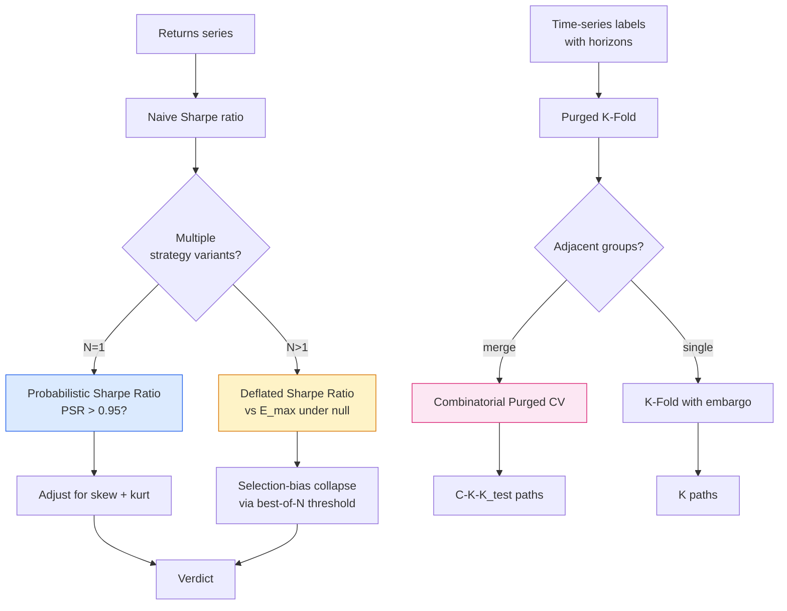

# quant-validation-zig

> Bailey & López de Prado bias-defence stack in Zig — PSR · DSR · Purged K-Fold · CPCV.

[](https://github.com/SMC17/quant-validation-zig/actions)
[](LICENSE)
[](https://ziglang.org/)
[](#tests)
[](#tests)

Statistical-validation primitives for quant research, in Zig 0.16.

A pre-1.0 substrate library — four small, focused modules that implement
the bias-defence stack from López de Prado, *Advances in Financial Machine
Learning* (2018) and the Bailey & López de Prado papers on the
Probabilistic and Deflated Sharpe Ratios. No backtesting harness, no
plotting, no surface area beyond what the algorithms need.

## What ships

Four modules and a worked example (`zig build dsr-demo`).

### `stats`
- `mean`, `variance(ddof)`, `stddev(ddof)`
- `skew` (Fisher), `kurtosis` (Pearson — normal = 3)
- `normCdf` via the 28-term Numerical Recipes Chebyshev approximation
  of `erfc` (absolute precision ~3e-8 across the relevant range, cross-
  checked against `scipy.stats.norm.cdf`)
- `normPpf` via Acklam's inverse-CDF algorithm (~1.15e-9 max relative error)

### `sharpe`
- `sharpeRatio(returns, rf_per_period)` — non-annualised, sample std (ddof = 1)
- `psr(sr_hat, sr_benchmark, n, skew, kurt)` — Probabilistic Sharpe Ratio
  (Bailey & López de Prado 2012)
- `psrFromReturns(returns, sr_benchmark)` — convenience wrapper that
  pulls n, skew, kurt from the sample
- `expectedMaxSharpe(variance_of_trial_sharpes, num_trials)` — the
  null-maximum SR threshold (Bailey & López de Prado 2014 eq. 7)
- `dsr(sr_hat, n, skew, kurt, variance_of_trial_sharpes, num_trials)` —
  Deflated Sharpe Ratio = PSR evaluated at the null-maximum

### `purged_cv`
- `purgedKFold(allocator, horizons, k, embargo)` — purged + embargoed
  K-Fold cross-validation generator (López de Prado AFML §7.4). Returns
  `Fold[]` of `{ train, holdout }` index slices.

### `cpcv`
- `cpcv(allocator, horizons, k, n_test_groups, embargo)` —
  Combinatorial Purged Cross-Validation (López de Prado AFML §7.5).
  Generates `C(k, n_test_groups)` train/test splits reusing the
  purging + embargo machinery from `purged_cv`. Adjacent fold groups
  merge into single test blocks so the embargo only fires at the
  trailing edge of each merged block. Returns the same `Fold[]` shape;
  free with `purged_cv.freeFolds`.

## What does NOT ship yet

The vocabulary deliberately matches the evidence. This library
**does not yet** provide:

- Multiple-testing correction (BH / Bonferroni / FDR) — planned for v0.2
- Bootstrap confidence intervals on PSR / DSR — planned for v0.2
- Hidden Markov regime detection — planned for v0.2
- Annualised Sharpe wrappers — caller's responsibility
- Any backtest execution, slippage, or transaction-cost model

The intended caller is a researcher who already has a returns series
and a model spec, and wants the bias-defence primitives wired in.

## Quickstart

```zig
const qv = @import("quant_validation");

// Probabilistic Sharpe Ratio against a zero benchmark
const p = qv.sharpe.psrFromReturns(daily_returns, 0.0);

// Deflated Sharpe Ratio across N tried strategies
const d = qv.sharpe.dsr(sr_hat, n, skew, kurt, v_of_trial_sharpes, num_trials);

// Purged K-Fold splits for a model whose labels span [t_i, t_i + h)
const folds = try qv.purged_cv.purgedKFold(allocator, horizons, 5, 10);
defer qv.purged_cv.freeFolds(allocator, folds);
for (folds) |f| {
    // train on f.train indices, evaluate on f.holdout indices
}

// Combinatorial Purged CV: C(K, n_test_groups) paths instead of K
const paths = try qv.cpcv.cpcv(allocator, horizons, 6, 2, 10);
defer qv.purged_cv.freeFolds(allocator, paths);
```

### Worked example

```sh
zig build dsr-demo
```

100 simulated strategy backtests over a year of trading days, every
series pure Normal(0, 0.01) noise (true Sharpe = 0). Prints the best
naive PSR(0) versus the Deflated Sharpe Ratio for the same winner —
the second number collapses toward 0.5 because the best-of-100
threshold is re-imposed. Reproduces the AFML §8 / Bailey-López de
Prado 2014 thesis on selection bias.

## How the validation stack defends against overfitting



The left branch defends the *significance* of a single Sharpe number
against finite-sample noise (PSR) and against selection across many
trials (DSR). The right branch defends *cross-validation* against
information leakage between train and holdout when labels span an
interval — purging removes the contaminated samples, embargo removes
the trailing-edge leakage, and CPCV multiplies the K-Fold path count
into `C(K, K_test)` for a denser distribution of out-of-sample
estimates.

## Tests

30 tests across the four modules, all passing. `zig build test` runs
both the internal unit tests and the external integration tests in
`tests/test_reference_numbers.zig`.

Reference numbers are either hand-computed and cross-checked against
scipy (`norm.cdf`, `norm.ppf` — `normCdf` matches to ~3e-8 absolute,
`normPpf` to ~1.15e-9 max relative error) or constructed so the analytic
answer is known (e.g. `psr(0, 0, n, 0, 3) == 0.5` for any n).

## Companion

[`stax-experiment`](https://github.com/SMC17/stax-experiment) is the
pre-registration CLI. Register the hypothesis and falsifier *before*
running the backtest, then use `quant-validation-zig` to compute the
PSR / DSR / CPCV verdict that the falsifier sentence requires.

A planned arXiv preprint documents the integration: pre-registration via
`stax-experiment` + bias-defence verdicts via `quant-validation-zig` as a
single empirical-discipline pipeline for agent-driven quant research.

## License

AGPL-3.0. See [`LICENSE`](LICENSE).

## Status

See [`STATUS.md`](STATUS.md) for the current build state and the open frontier.
